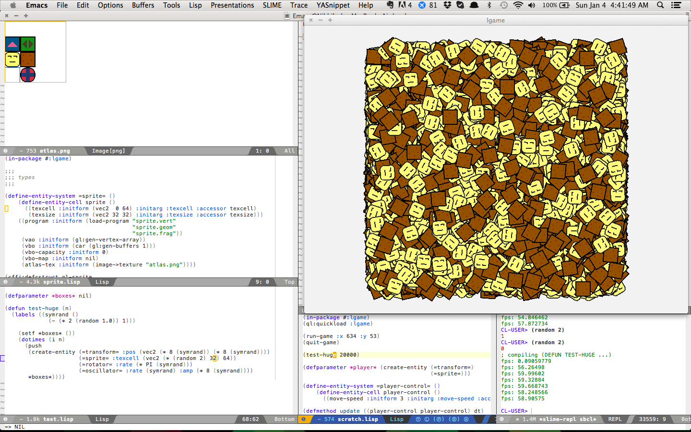

An attempt at reducing creative friction between the artist and the
artwork.

Running
-------

NOTE: you may need to put `(setf swank:*communication-style* :fd-handler)` in
your ~/.swank.lisp to allow the Lisp process to interact with SLIME while the
game loop is running.

Put the lgame directory somewhere quicklisp can find it. Then,

    (ql:quickload :lgame)

Alternatively, load it using ASDF or just manually from a REPL.

After that, get in the package,

    (in-package :lgame)

Now you're ready to roll! Just run,

    (run-game)

Check the bottom of test.lisp to see how the oscillator and rotator systems are
defined. You can interact with the game in real-time using the REPL. For
example, `(run-game)` then `(test-basic)`. Then `(setf (rate (=oscillator=
*player*)) 3)` while the game is running.

